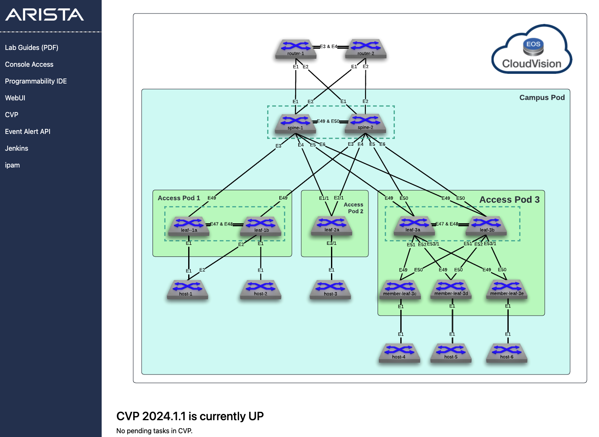
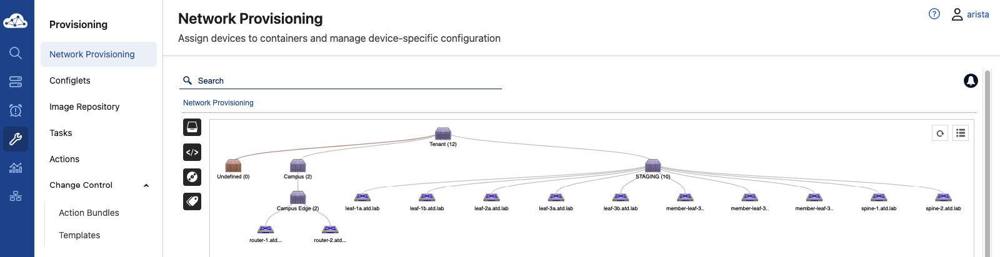
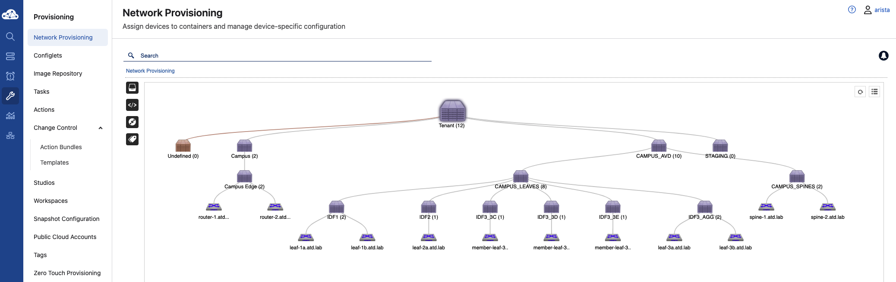

# Step-by-step demo

## 1. Connect to GUI VM

In your ATD interface, click on __Programmability IDE__ and use the password listed on your lab topology.

> __Note:__ Unique password is auto-generated for each lab instance.



In addition, open CloudVision Portal (CVP) by clicking the __CVP__ link. Then, log in with the username `arista` and the auto-generated password on the lab topology screen.

## 2. Configure your credential

Because the password is auto-generated, you must update the `ansible_password` variable. We will read a configuration file to set our credential file as an environment variable.

Run the following commands from the Programmability IDE terminal:

```shell
export LABPASSPHRASE=`cat /home/coder/.config/code-server/config.yaml| grep "password:" | awk '{print $2}'`
```

## 3. Install all the requirements

The code block below performs the following actions:

- Moves to the `labfiles` directory
- Installs version `4.8.0` of the `arista.avd` collection
- Exports an environment variable based on the location of the `arista.avd` collection
- Leverages the new environment variable to install the Python requirements for arista.avd
- Clones this repository
- Moves to the cloned repository folder

```shell
# Go to labffiles folder
cd /home/coder/project/labfiles

# Export lab credentials to env variable
export LABPASSPHRASE=`cat /home/coder/.config/code-server/config.yaml| grep "password:" | awk '{print $2}'`
ansible-galaxy collection install arista.avd:==4.8.0

# Ensure AVD python requirements are up-to-date
export ARISTA_AVD_DIR=$(ansible-galaxy collection list arista.avd --format yaml | head -1 | cut -d: -f1)
pip3 install -r ${ARISTA_AVD_DIR}/arista/avd/requirements.txt

# Clone repository to your local ATD
git clone https://github.com/arista-netdevops-community/atd-avd-campus.git
cd atd-avd-campus
```

## 4. Prepare ATD

To emulate a ZTP environment, we will move all devices from their current containers to a dedicated one named `STAGING` to mimic an `undefined` container.

```bash
ansible-playbook playbooks/atd-prepare-lab.yml
```

- This playbook executes the following tasks:
  - Recreates the container topology in staging format
  - Moves nodes to the appropriate container
  - Executes pending tasks for the user on CVP
- Provisioning topology view should be similar to below

  

## 4. Apply AVD configuration

While the playbook supports build/provision/execute in one sequence, we will proceed step-by-step.

### Build device configurations and documentation files

```bash
ansible-playbook playbooks/atd-fabric-build.yml
```

You can review the generated output in your VScode instance:

- EOS Configuration: [atd-inventory/intended/configs](atd-inventory/intended/configs)
- Fabric documentation: [atd-inventory/documentation](atd-inventory/documentation)

### Provision CVP

```bash
ansible-playbook playbooks/atd-fabric-provision.yml
```

This playbook creates the following:

- A new containers topology to support AVD devices based on inventory file
- Move devices to their respective container
- Create configlet per device and bind to devices

Change control remains on the user's side as it's a safer approach for production. We have the option to execute tasks automatically on CloudVision as well.

> Create the change control and execute all pending tasks.



## 5. Add a new tenant to the fabric

Edit the [CAMPUS_SERVICES.yml](atd-inventory/group_vars/CAMPUS_SERVICES.yml) file and uncomment `id: 120` block before running the playbook.

```yaml
# edit atd-inventory/group_vars/CAMPUS_SERVICES.yml
tenants:
  - name: CAMPUS_SERVICES
    vrfs:
      - name: default
        svis:
# < ... >
          - id: 120
            name: 'IDF1-Voice'
            tags: ["120"]
            enabled: true
            ip_virtual_router_addresses:
              - 10.1.20.1
            nodes:
              - node: SPINE1
                ip_address: 10.1.20.2/23
              - node: SPINE2
                ip_address: 10.1.20.3/23
```

- Run the build and provision playbooks once again.

  ```bash
  ansible-playbook playbooks/atd-fabric-build.yml
  ansible-playbook playbooks/atd-fabric-provision.yml
  ```

  > Once more, create a change control in CVP and execute all tasks.

## 6. Filter VLANs deployed on the fabric

All VLANs configured under the [ATD_TENANTS_NETWORKS.yml](atd-inventory/group_vars/ATD_TENANTS_NETWORKS.yml) file have been deployed to our fabric, whether we have client-facing interfaces configured for those VLANs or not. For example, below is the current output from leaf1.

```eos
leaf-1a#show vlan
VLAN  Name                             Status    Ports
----- -------------------------------- --------- -------------------------------
1     default                          active    Po47
110   IDF1-Data                        active    Et1, PEt1, Po47, Po49
210   IDF2-Data                        active    Po47, Po49
4094  MLAG_PEER                        active    Cpu, Po47
```

Focusing on IDF-specific VLANs, only VLAN 110 is assigned to any host-facing interfaces. We can enable the filtering option and check back on leaf1.

To enable the filtering feature, uncomment the `filters` variable within the `l3leaf` key in the [CAMPUS_AVD.yml](atd-inventory/group_vars/CAMPUS_AVD.yml) file.

```yaml
...
leaf:
  node_groups:
    - group: IDF1
      mlag: true
      uplink_interfaces: [Ethernet49]
      mlag_interfaces: [Ethernet47, Ethernet48]
      filter:
        tags: [ "110", "120", "130" ]
...
```

Do the same thing in your service definition under [CAMPUS_SERVICES.yml](atd-inventory/group_vars/CAMPUS_SERVICES.yml):

```yaml
...
tenants:
  - name: CAMPUS_SERVICES
    vrfs:
      - name: default
        svis:
          - id: 110
            name: 'IDF1-Data'
            tags: ["110"]
            enabled: true
...
```

- Run the build and provision playbooks once again.

  ```bash
  ansible-playbook playbooks/atd-fabric-build.yml
  ansible-playbook playbooks/atd-fabric-provision.yml
  ```

  Once more, in CVP, create a change control and execute all tasks. Below is the new output from leaf1 with VLANs filtered.

```eos
leaf-1a#show vlan
VLAN  Name                             Status    Ports
----- -------------------------------- --------- -------------------------------
1     default                          active    Po47
110   IDF1-Data                        active    Et1, PEt1, Po47, Po49
4094  MLAG_PEER                        active    Cpu, Po47
```

## 7. Connected endpoints or network ports

AVD can now use a more generic definition of host-facing ports. The `network_ports` feature is useful when a series of interfaces share the same configuration. For example, if we wanted interface four on leaf-1a and leaf-1b configured similarly, we could do something like the following:

```yaml
---
port_profiles:
  - profile: PP-DOT1X
    mode: "trunk phone"
    spanning_tree_portfast: edge
    spanning_tree_bpduguard: enabled
    dot1x:
      port_control: auto
      reauthentication: true
      pae:
        mode: authenticator
      host_mode:
        mode: multi-host
        multi_host_authenticated: true
      mac_based_authentication:
        enabled: true
      timeout:
        reauth_period: server
        tx_period: 3
      reauthorization_request_limit: 3
...
network_ports:
  - switches:
      - leaf-1[ab]    # regex match LEAF-1a & LEAF-1b
    switch_ports:
      - Ethernet1-48
    description: IDF1 dot1x port
    profile: PP-DOT1X
    native_vlan: 110
    structured_config:
      phone:
        trunk: untagged
        vlan: 120
    dot1x:
      authentication_failure:
        action: allow
        allow_vlan: 130
```

Uncomment configuration for ports connected to __leaf-2a__ before running playboks

- Run the build and provision playbooks once again.

```bash
ansible-playbook playbooks/atd-fabric-build.yml
ansible-playbook playbooks/atd-fabric-provision.yml
```

  We can see the generated configuration from the [leaf3](atd-inventory/intended/configs/leaf3.cfg) configuration file.

```eos
interface Ethernet1
   description IDF1 dot1x port
   switchport trunk native vlan 110
   switchport phone vlan 120
   switchport phone trunk untagged
   switchport mode trunk phone
   spanning-tree portfast
   spanning-tree bpduguard enable
   dot1x pae authenticator
   dot1x authentication failure action traffic allow vlan 130
   dot1x reauthentication
   dot1x port-control auto
   dot1x host-mode multi-host authenticated
   dot1x mac based authentication
   dot1x timeout tx-period 3
   dot1x timeout reauth-period server
   dot1x reauthorization request limit 3
!
```
