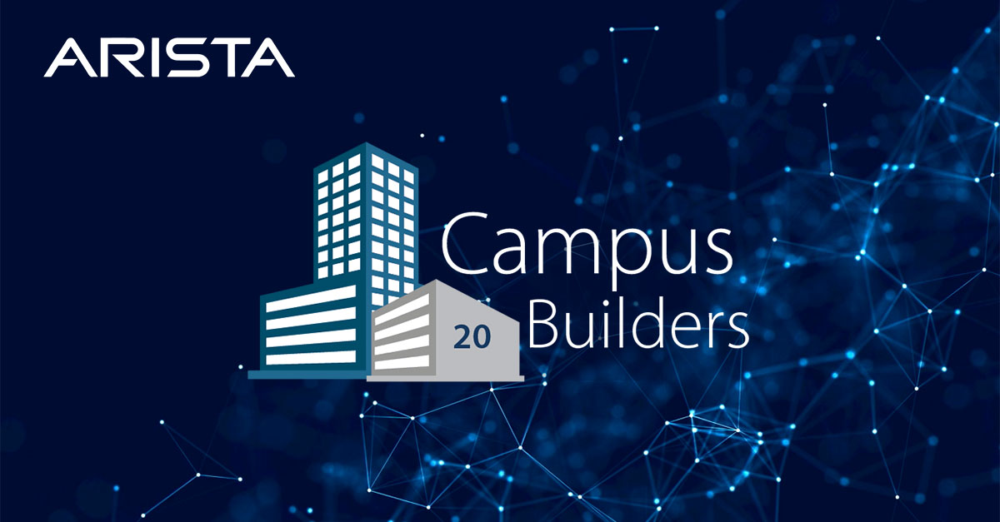
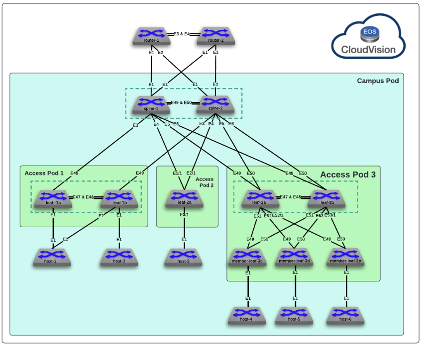

# AVD Arista Validated Design for Arista Campus Test Drive

 

## About

This repository is configured to run [`arista.cvp`](https://github.com/aristanetworks/ansible-cvp) & [`arista.avd`](https://github.com/aristanetworks/ansible-avd) Ansible collections against the Arista Test Drive (ATD) single data center topology.

<p align="center">
  
</p>

To access an ATD topology, please get in touch with your Arista representative.

## Lab topology

The diagram below shows that the ATD lab topology has two data centers. We will only leverage DC1 in this example.

<p align="center">
  
</p>

## ATD topology device list

| Device          | IP Address   |
| --------------- | ------------ |
| spine-1         | 192.168.0.12 |
| spine-2         | 192.168.0.13 |
| leaf1a          | 192.168.0.14 |
| leaf1b          | 192.168.0.15 |
| leaf2a          | 192.168.0.16 |
| leaf3a          | 192.168.0.17 |
| leaf3b          | 192.168.0.18 |
| member-leaf-3c  | 192.168.0.19 |
| member-leaf-3d  | 192.168.0.20 |
| member-leaf-3e  | 192.168.0.21 |

> Current repository is built with cEOS management interface (`Management0`). If you run a vEOS topology, please update `mgmt_interface` field to `Management1` in the [ATD_LAB](./atd-inventory/group_vars/ATD_LAB.yml) `group_vars`.

## Getting Started

### Connect to your ATD lab environment

- Don't hesitate to contact your local account team if you need an ATD Lab instance.
- Once connected to the ATD lab instance, select the Programmability IDE.
- This container is built with all the requirements and Python modules to run AVD playbooks.

1. Next (optional), set up a Git user and email for the ATD lab environment

    - Open a terminal window in VS Code View -> Terminal from the menu, and run the following commands:

```bash
# Setup your git global config (optional)
git config --global user.email "you@example.com"
git config --global user.name "Your Name"
```

2. Set credentials and install any required tools

```bash
# Go to labffiles folder
cd /home/coder/project/labfiles

# Export lab credentials to env variable
export LABPASSPHRASE=`cat /home/coder/.config/code-server/config.yaml| grep "password:" | awk '{print $2}'`
ansible-galaxy collection install arista.avd:==4.8.0

# Ensure AVD python requirements are up-to-date
export ARISTA_AVD_DIR=$(ansible-galaxy collection list arista.avd --format yaml | head -1 | cut -d: -f1)
pip3 install -r ${ARISTA_AVD_DIR}/arista/avd/requirements.txt

# Clone repository to your local ATD
git clone https://github.com/arista-netdevops-community/atd-avd-campus.git
cd atd-avd-campus
```

3. Run the playbook to prepare CloudVision for AVD

- Execute the following command:

```shell
ansible-playbook playbooks/atd-prepare-lab.yml
```

- Check that tasks in CloudVision have been automatically completed

4. Run playbook to deploy AVD setup

- Run the following commands:

```shell
ansible-playbook playbooks/atd-fabric-build.yml
ansible-playbook playbooks/atd-fabric-provision.yml
```

- Run pending tasks in CloudVision Portal manually.

5. Run validation and snapshot playbooks

- Run the following commands:

```shell
# Run audit playbook to validate the fabric state
ansible-playbook playbooks/atd-validate-states.yml

# Run the atd-snapshot playbook to collect show commands
ansible-playbook playbooks/atd-snapshot.yml
```

- Review generated output.

## Step-by-step walkthrough

A complete [step-by-step guide](./DEMO.md) is available.

## Resources

- [Arista Ansible AVD Collection](https://github.com/aristanetworks/ansible-avd)
- [Arista CloudVision Collection](https://github.com/aristanetworks/ansible-cvp)
- [Arista AVD documentation](https://avd.arista.com)

## License

This Project is published under Apache License.
